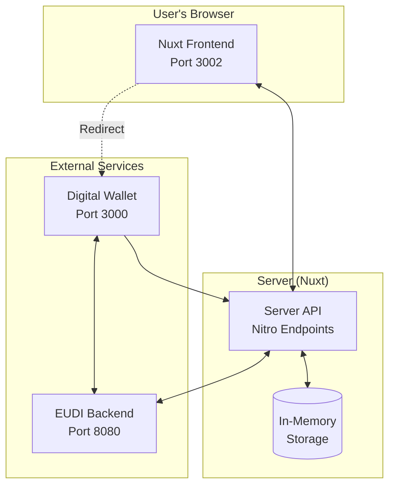
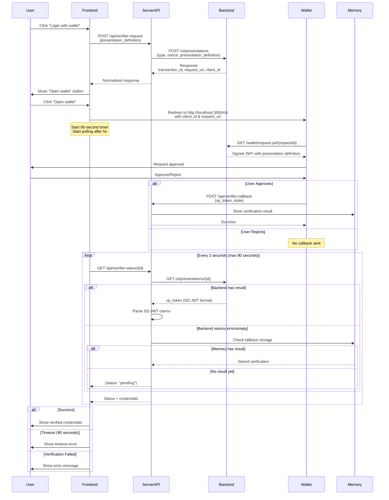

# wallet-verifier-test-web

[](https://api.reuse.software/info/github.com/diggsweden/wallet-verifier-test-web)
[](https://scorecard.dev/viewer/?uri=github.com/diggsweden/wallet-verifier-test-web)


Demo application demonstrating how a relying party may implement authentication using EUDI wallet verification.

## Quick Start

### Docker

```bash
npm install
npm run generate
docker compose -f ./docker/docker-compose.yml up -d
```

Open [http://localhost:3002](http://localhost:3002)

### Development

```bash
npm run dev
```

### Testing

```bash
npm run test        # watch mode
npm run test:once   # single run
```

### Full Wallet Ecosystem

See [docker/README.md](./docker/README.md) for running a complete wwWallet ecosystem with this application.

## Architecture



### Verification Flow


